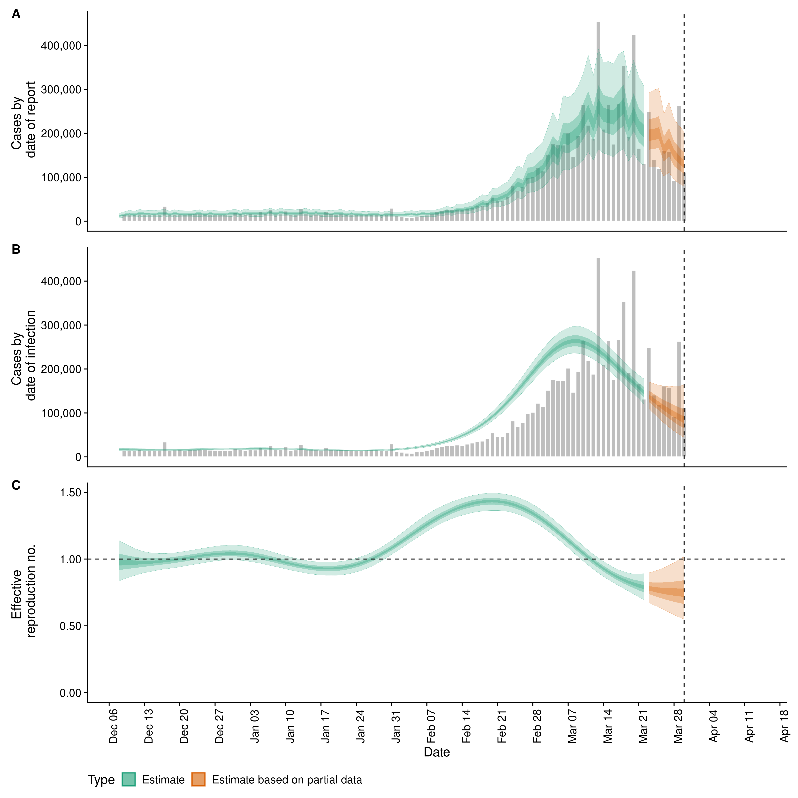

```{r, include = FALSE}
knitr::opts_chunk$set(echo = FALSE, eval = TRUE,
                      fig.width = 12, fig.height = 12,
                      message = FALSE,
                      warning = FALSE,
                      dpi = 300)
```

*Using data available up to the:* `r Sys.Date()`

*Note that it takes time for infection to cause symptoms, to get tested for SARS-CoV-2 infection, for a positive test to return and ultimately to enter the case data presented here. In other words, today’s case data are only informative of new infections about two weeks ago. This is reflected in the plots below, which are by date of infection.*

*Estimates are available to download [here](https://dataverse.harvard.edu/dataverse/covid-rt).*

*See our see [Methods](https://epiforecasts.io/covid/methods) or our [paper](https://wellcomeopenresearch.org/articles/5-112/) for an explanation of how these estimates are derived.*

```{r load-custom-data, include = FALSE}
load(here::here("_posts/national/vietnam/vietnam_codes.rda"))
```

```{r load-geodata, include = FALSE}
library(dplyr)
geoData <- rnaturalearth::ne_states('Vietnam', returnclass = 'sf') 
geoData <- dplyr::left_join(geoData, vietnam_codes, by = c("iso_3166_2"="level_1_region_code")) %>%
  dplyr::rename(Region = level_1_region)
```

```{r load-defaults, include = FALSE}
region <- "Vietnam"
folder <- "vietnam"
source(here::here("utils/subnational_defaults.R"), local = TRUE)
source(here::here("utils/epi_leaflet.R"), local = TRUE)
subnational_unit <- "Region"
```

*Using data available up to the:* `r latest_date`

*Subnational and national estimates are available to download [here](https://dataverse.harvard.edu/dataverse/covid-rt).*

*See our see [Methods](https://epiforecasts.io/covid/methods) or our [paper](https://wellcomeopenresearch.org/articles/5-112/) for an explanation of how these estimates are derived.*

## National summary

```{r, include = FALSE}
summary_tables <-0
summary_figures <-0
title_depth <- 3
index <- 1
region_path <- "covid-rt-estimates/national/cases/national"
show_title <- FALSE
report_forecast <- TRUE
interactive <- TRUE
standalone <- FALSE
```


```{r}
library(tibble)
library(knitr)
library(kableExtra)
library(here)

if (!exists("case_def")) {
  case_def <- "case"
}

if (!exists("report_growth")) {
  report_growth <- TRUE
}
```

`r paste(c(rep("#", title_depth), paste0(" Summary (estimates as of the ", latest_date, ")")), collapse = "")`


`r paste0("*Table ",  summary_tables + index, ": Latest estimates (as of the ", latest_date,  ") of the number of confirmed ", case_def, "s by date of infection, the expected change in daily confirmed ", case_def, "s, the effective reproduction number, the growth rate, and the doubling time (when negative this corresponds to the halving time). The median and 90% credible interval is shown for each numeric estimate.*")`
<br>
```{r}
readRDS(here::here(file.path(region_path, region, "latest/summary.rds"))) %>% 
.[, 1:2] %>% 
knitr::kable(col.names = c("", "Estimate"), booktabs = TRUE) %>% 
    kableExtra::kable_styling(latex_options = c("striped", "hold_position"),
                full_width = TRUE)
```


`r paste(c(rep("#", title_depth), " Confirmed ", case_def, "s, their estimated date of report, date of infection, and time-varying reproduction number estimates"), collapse = "")`




<br>
`r paste0("*Figure ",  summary_figures + 1 + (index - 1) * 2, ": A.) Confirmed ",  case_def, "s by date of report (bars) and their estimated date of report. B.) Confirmed ",  case_def, "s by date of report (bars) and their estimated date of infection. C.) Time-varying estimate of the effective reproduction number (lightest ribbon = 90% credible interval; darker ribbon = the 50% credible interval, darkest ribbon = 20% credible interval). Estimates from existing data are shown up to the ", latest_date, ifelse(report_forecast, " from when forecasts are shown. These should be considered indicative only", ""),  ". Estimates based on partial data have been adjusted for right truncation of infections. The vertical dashed line indicates the date of report generation. Uncertainty has been curtailed to a maximum of ten times the maximum number of reported cases for plotting purposes.*")`


## Subnational breakdown

```{r}
fig_tab_no <- 2
```

```{r,  child = here::here("utils", "national-map.Rmd")}
```

### Data availability

* Case counts by date, stratified by region were downloaded from a publicly available source [@covidregionaldata; @noauthor_tabelle_2020].
* Case onset dates were estimated using case counts by date of report and a distribution of reporting delays fitted to a publicly available line-list of cases reported internationally [@kraemer2020epidemiological; @covidregionaldata].

### Limitations

* Line-list data to inform a region specific estimate of the reporting delay were not available.


`r if (show_title) paste0('#### ', stringr::str_to_title(region_name))`

